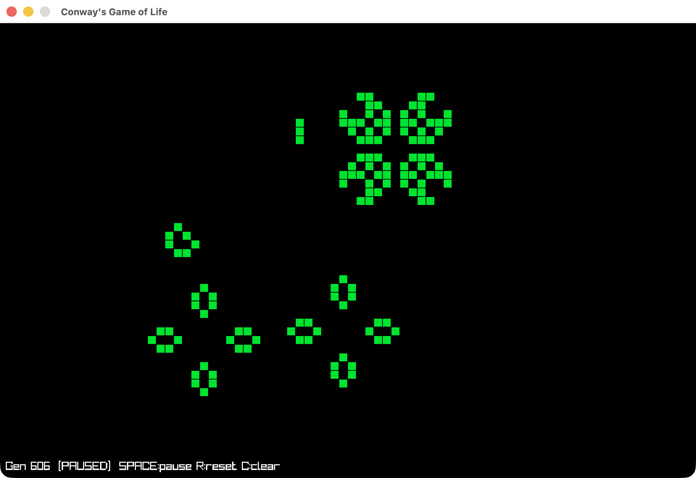

# zigway-game-life

Conway's Game of Life in Zig, with a terminal interface and a raylib GUI.



inspired by [Tsoding](https://www.youtube.com/watch?v=kbUvzR8s1Co)

## Build

Requires [Zig 0.15](https://ziglang.org/download/) and the bundled `raylib-5.5_macos/` directory (already included).

```sh
zig build
```

## Run

### Terminal

```sh
zig build run
```

A 60×30 grid evolves at 10 generations per second. Kill with `Ctrl+C`.

### GUI (raylib)

```sh
zig build run-raylib
```

An 80×50 grid opens in a window.

| Key / Mouse  | Action           |
| ------------ | ---------------- |
| `Space`      | Pause / resume   |
| `R`          | New random board |
| `C`          | Clear the board  |
| Left click   | Draw live cells  |
| Right click  | Erase cells      |
| Close window | Quit             |

## Rules

Standard Conway's Game of Life:

- A live cell with 2 or 3 live neighbours survives.
- A dead cell with exactly 3 live neighbours becomes alive.
- All other cells die or stay dead.
